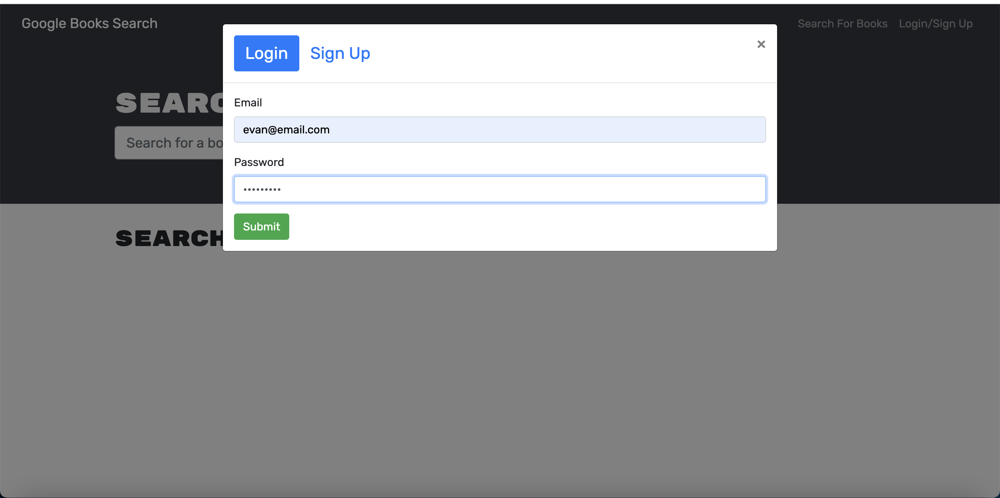
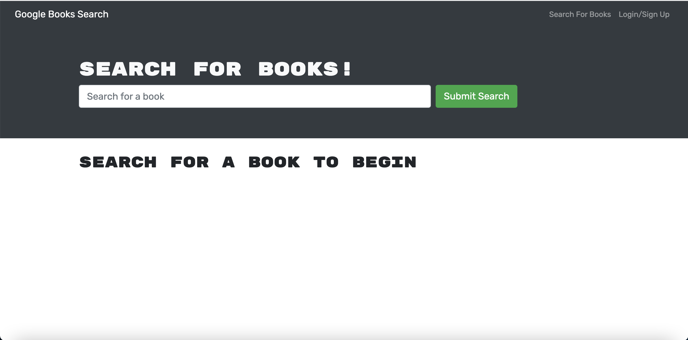
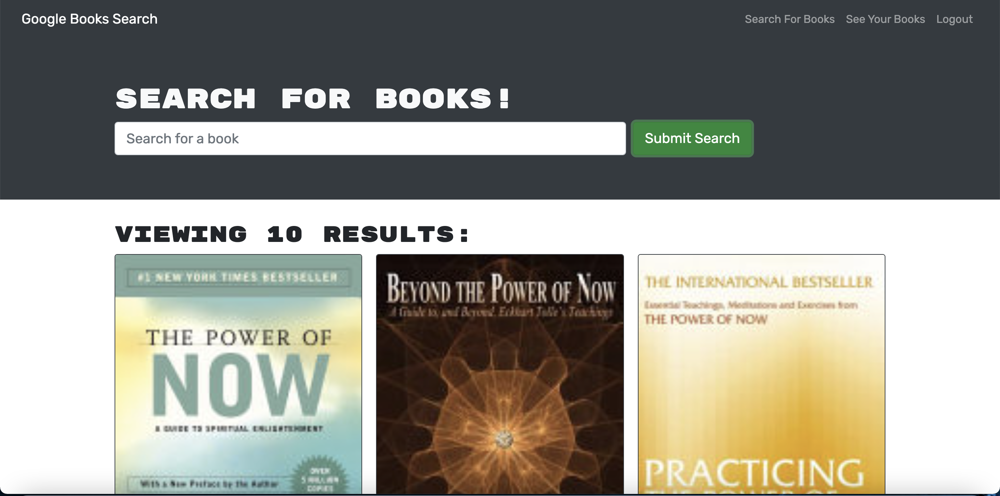
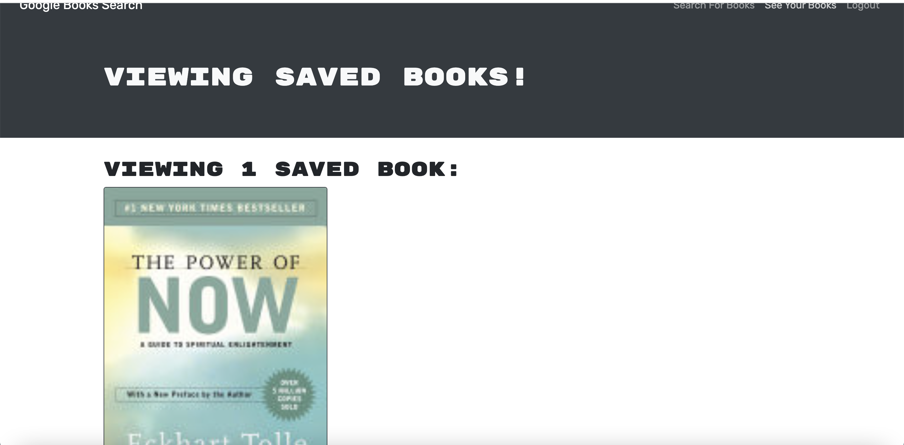
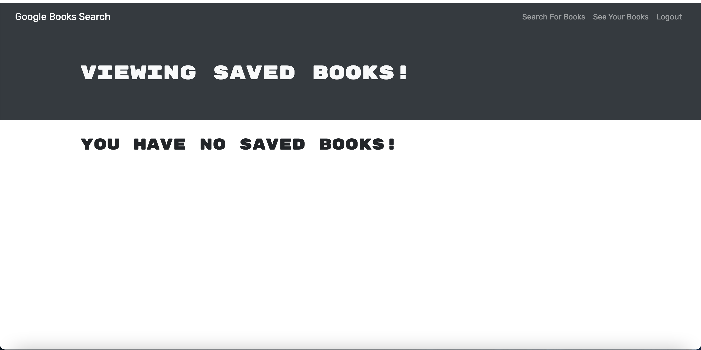

# Book Finder Search Engine 
  This assignment was for our coding bootcamp.We were provided with some starter code and our job was to refactor it and make it become a MERN stack app.
  # Table of Contents:
  * [Installation](#installation)
  * [Usage](#usage)
  * [Contributing](#contributing)
  * [Credits](#credits)
  * [Tests](#tests)
  * [Questions](#questions)
  * [Screenshots](#screenshots)
  * [License](#license)
---
  ## Installation:
  There are no instuctions needed. All you need to do is go to the deployed link and enjoy the app!
  ## Usage:
  This app is used to save your favorite books!
  ## Contributing:
  No guidelines to follow.
  ## Credits:
  A TON of credit goes to my TAs, instructor and my classmates. My classmate Fiona, Sam, Edyta, and Brianna helped me finish this assignment because I kept missing simple changes. Fiona and Sam were a HUGE help! They stayed up late at night with me to help me with this assignment so S/O to them!!!
  ## Tests:
  N/A
  ## Questions:
  For any further assistance, you may contact me at:
  * Github: [ebulliner](<https://github.com/ebulliner>)
  OR
  * Email: evan_bulliner@yahoo.com
  ## Screenshots:
  
  
  
  
  
  ---
  ___
# License
  ## MIT
  This project is licensed under the [MIT License](https://opensource.org/licenses/MIT).